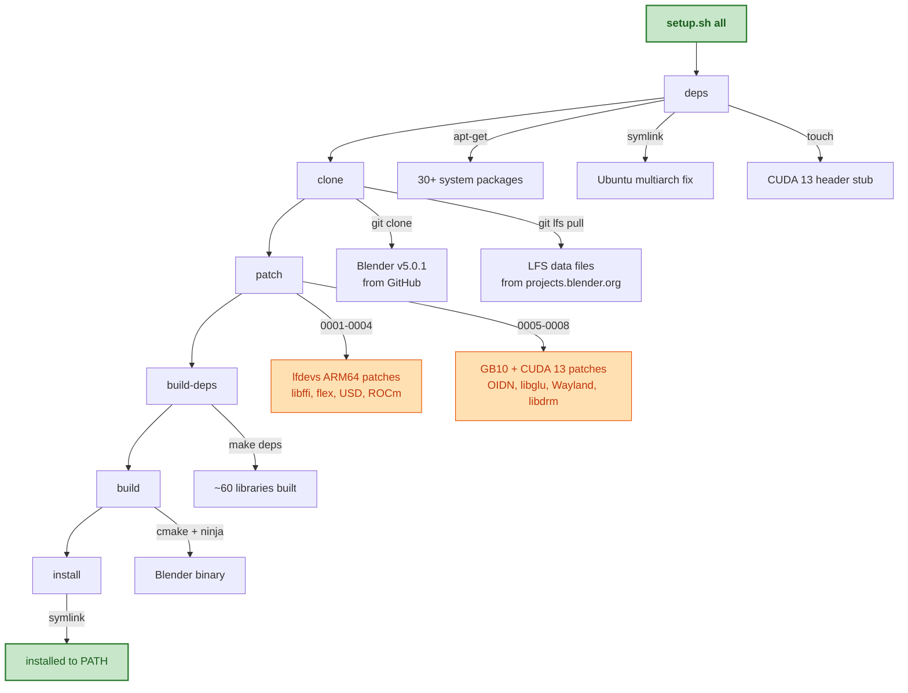
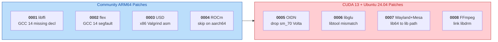
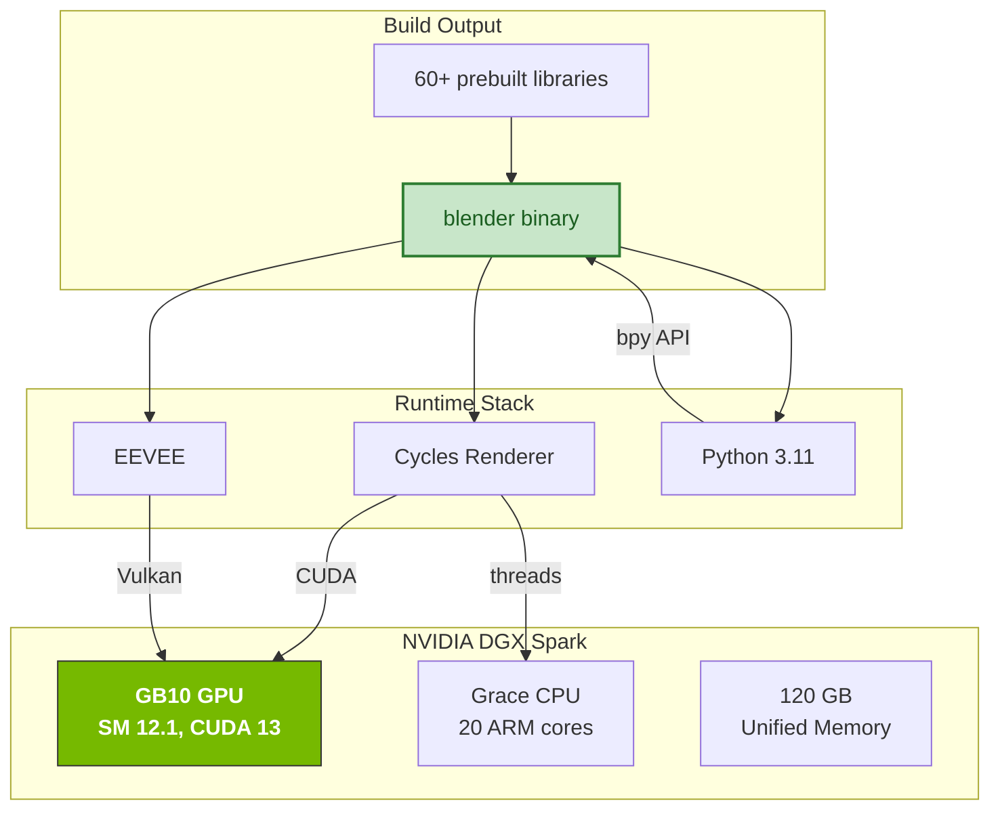
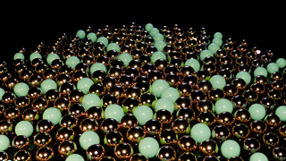
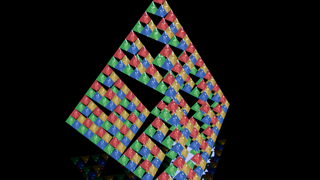
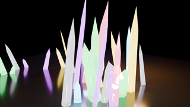
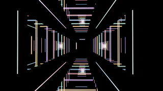

# Blender 5.0.1 on NVIDIA GB10 (DGX Spark)

Build Blender from source on **Linux ARM64** with full **CUDA GPU** support — one command, one hour.

```
$ blender --version
Blender 5.0.1

$ blender -b --python my_script.py   # headless rendering on GB10
```

## Why

There are no official Blender builds for Linux ARM64. Community efforts exist for CPU-only builds, but none support CUDA on the new NVIDIA GB10 (compute capability 12.1) with CUDA 13.

This repo provides a **fully automated, one-command build** that produces a feature-complete Blender with Cycles GPU rendering on the DGX Spark.

## Target System

| Component | Version |
|-----------|---------|
| Hardware | NVIDIA DGX Spark / GB10 |
| GPU Compute | SM 12.1 (Blackwell) |
| OS | Ubuntu 24.04 LTS (noble) |
| Arch | aarch64 (ARM64) |
| CUDA | 13.0+ |
| Driver | 580.x+ |
| GCC | 13.3 |

## Quick Start

```bash
git clone https://github.com/mvalancy/blender-nvidia-gb10.git
cd blender-nvidia-gb10
./setup.sh all    # ~1 hour total
blender --version
```

Or run individual steps:

```bash
./setup.sh deps        # Install system packages
./setup.sh clone       # Clone Blender v5.0.1
./setup.sh patch       # Apply ARM64 + CUDA 13 patches
./setup.sh build-deps  # Build 60+ third-party libs (~45 min)
./setup.sh build       # Build Blender (~10 min)
./setup.sh install     # Symlink to /usr/local/bin
```

Completed steps are checkpointed — re-running skips them automatically:

```bash
./setup.sh --status        # Show which steps are complete vs pending
./setup.sh --force build   # Re-run a step (ignoring checkpoint)
./setup.sh --clean         # Remove all checkpoints and build artifacts
./setup.sh --verbose all   # Show full build output instead of spinner
./setup.sh --help          # Full usage info
```

## Build Pipeline



## What Gets Patched (and Why)

Blender's build system assumes x86 Linux. Eight patches fix the ARM64 + CUDA 13 gaps:



### Patch Details

| # | File Modified | Problem | Fix |
|---|--------------|---------|-----|
| 0001 | `deps/cmake/libffi.cmake` | Missing declaration in libffi with GCC 14 | Add forward declaration |
| 0002 | `deps/cmake/flex.cmake` | flex segfaults via `reallocarray` on GCC 14 | Patch flex source |
| 0003 | `deps/cmake/usd.cmake` | USD includes x86 Valgrind assembly on Linux | Gate behind `__x86_64__` |
| 0004 | `deps/cmake/ispc.cmake` | ROCm packages are x86-only | Skip on `BLENDER_PLATFORM_ARM` |
| 0005 | `deps/cmake/openimagedenoise.cmake` | CUDA 13 dropped sm_70 (Volta) | Remove sm_70 targets at build time |
| 0006 | `deps/cmake/libglu.cmake` | libtool 2.4.6 vs 2.4.7 version mismatch | Run `autoreconf -fi` before configure |
| 0007 | `deps/cmake/wayland.cmake` + 4 more | Meson installs to `lib/` not `lib64/` on aarch64 | Conditional harvest paths |
| 0008 | `cmake/platform/platform_unix.cmake` | FFmpeg kmsgrab needs libdrm symbols | Add `find_library(DRM_LIBRARY drm)` |

### Additional System Workarounds

These are handled automatically by `setup.sh deps`:

| Issue | Cause | Fix |
|-------|-------|-----|
| ISPC can't find `bits/wordsize.h` | Ubuntu multiarch puts headers in `/usr/include/aarch64-linux-gnu/` | Symlink `bits`, `gnu`, `asm` to `/usr/include/` |
| Clang errors on `texture_fetch_functions.h` | CUDA 13 removed this header; Clang's wrapper still includes it | Create empty stub file |
| Blender segfaults on startup | Git LFS pointers instead of real data files (131 bytes vs 1MB+) | Pull LFS from `projects.blender.org` |

## Architecture



## Headless / AI Usage

The primary use case is running Blender headlessly for automated 3D workflows:

```bash
# Render a scene on the GPU
blender -b scene.blend -o //output_ -F PNG -f 1 -- --cycles-device CUDA

# Run a Python script
blender -b --factory-startup --python my_pipeline.py

# Detect GPU from Python
blender -b --factory-startup --python-expr "
import bpy
prefs = bpy.context.preferences.addons['cycles'].preferences
prefs.get_devices()
for d in prefs.get_devices_for_type('CUDA'):
    print(f'{d.name} (use={d.use})')
"
# Output: NVIDIA GB10 (use=True)
```

## Verification

After building, run the included test:

```bash
blender -b --factory-startup --python test_blender.py
```

Expected output:
```
Blender 5.0.1
  [CUDA] NVIDIA GB10 (use=True)
  Cycles GPU render: PASS
  Cycles CPU render: PASS
  Python API: PASS
  File I/O: PASS
```

## Benchmark

The included `benchmark.py` creates a procedural Menger sponge fractal (400 glass/metal cubes) with volumetric lighting, then renders at multiple resolutions on the GPU:

```bash
blender -b --factory-startup --python benchmark.py
```

Results on NVIDIA GB10:

| Resolution | Samples | Time |
|-----------|---------|------|
| 480x270 | 16 | 1.6s |
| 1280x720 | 64 | 9.3s |
| 1920x1080 | 128 | 24.9s |


*Menger sponge fractal — glass BSDF, metal BSDF, emission, volumetric scatter — rendered on the GB10 via Cycles CUDA.*

## Gallery

All renders generated headlessly on the GB10 via `blender -b --factory-startup --python <script>`. Source scripts in [`renders/`](renders/).

| | |
|:---:|:---:|
| [](images/golden_spiral.png) | [](images/glass_fractal.png) |
| **Golden Fibonacci Spiral** — 300 metallic + SSS spheres, 384 samples | **Glass Sierpinski Tetrahedron** — 256 emissive glass tetrahedra, 512 samples |
| [](images/crystal_cave.png) | [](images/infinite_mirrors.png) |
| **Crystal Cave** — 42 hexagonal crystals on polished obsidian, 384 samples | **Infinite Mirror Corridor** — 64-bounce neon reflections, 512 samples |

## Environment Variables

| Variable | Default | Description |
|----------|---------|-------------|
| `BLENDER_BUILD_DIR` | `~/blender-gb10-build` | Override the build/source/checkpoint directory |
| `NO_COLOR` | *(unset)* | Disable colored output (also auto-disabled when piped) |

```bash
export BLENDER_BUILD_DIR=/path/to/build
./setup.sh all
```

## Disk & Time Requirements

| Resource | Requirement |
|----------|-------------|
| Disk space | ~50 GB (source + deps + build) |
| Build time (deps) | ~45 minutes |
| Build time (Blender) | ~10 minutes |
| RAM | 8 GB minimum, 16+ GB recommended |
| Internet | ~5 GB download (source + deps) |

## Credits

- [lfdevs/blender-linux-arm64](https://github.com/lfdevs/blender-linux-arm64) — Community ARM64 CI builds and patches 0001-0004
- [CoconutMacaroon/blender-arm64](https://github.com/CoconutMacaroon/blender-arm64) — DGX Spark build reference
- [Blender Developer Forum](https://devtalk.blender.org/t/linux-aarch64-source-build/35311) — Community build guidance
- [Blender](https://www.blender.org/) — The amazing open-source 3D suite

## License

The patches in this repository are provided under the same license as Blender ([GPL-3.0](https://www.gnu.org/licenses/gpl-3.0.en.html)). Blender itself is not included — it is cloned from the official repository during the build.
